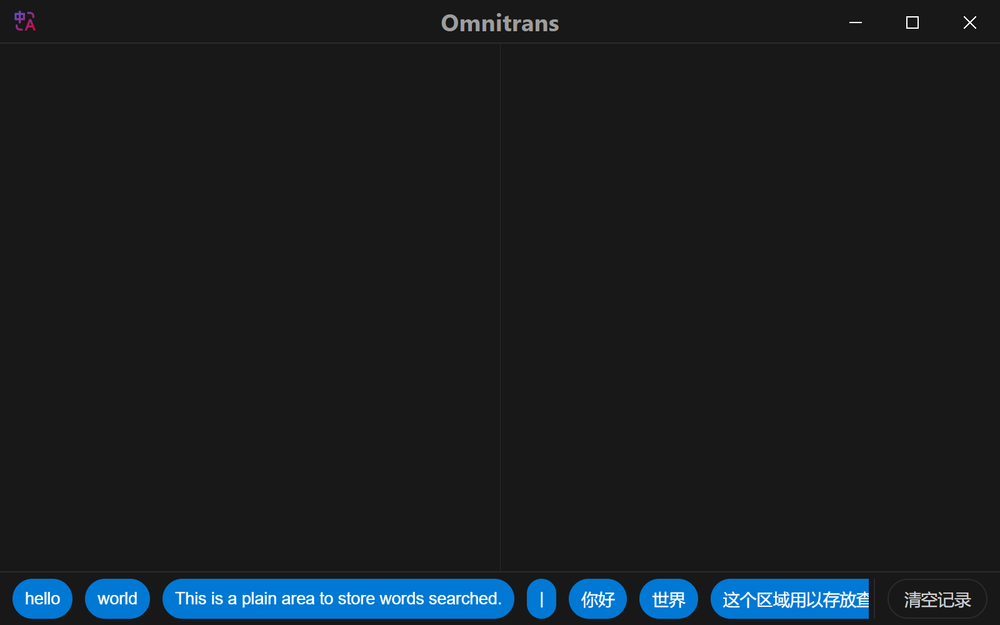

# Omnitrans

One electron app which supports searching words anytime and anywhere. (Only supports windows now.)



## Quick Start

Download the latest package and install it.
You can search any English text or Chinese text you see on the screen **Just By Pressing `Ctrl+C+C`**.

## Development

Fork this repository and install the necessary packages. Then run the following commands:

```sh
npm run dev  # start the Vue service in one terminal
npm start  # start the electron in another terminal
```

## Production

Run the following commands to pack the application:

```sh
npm run build  # compile the Vue files
npm run pack  # pack the electron app using electron-builder
```

After this, the `installer.exe` should be in your `./build` folder.
